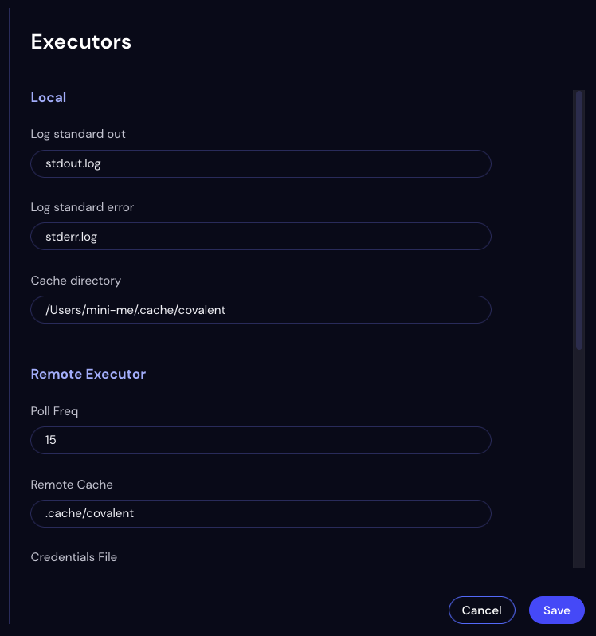

#########
Executors
#########

Use the Executors Settings page to view and change executor preferences for all executors. When you use a remote executor, the executor's settings become available in the Executors list. The built-in local and Dask cluster executors are always available.

.. note:: Click Save to enable all changes made in the Executors list. Clicking Cancel reverts all fields to their pre-changed values.

Local
-----

Log Standard Out
    The name of the file to which the local executor logs :code:`stdout`. The file is located in dispatch- and node-specific subdirectories of the results directory.
Log Standard Error
    The name of the file to which the local executor logs :code:`stderr`. The file is located in dispatch- and node-specific subdirectories of the results directory.
Cache Directory
<<<<<<< HEAD
    The directory path to which all intermediate data and results are logged.
=======
    The directory path ???
>>>>>>> 764dc406 (Revised the UI reference.)

Dask
----

Log Standard Out
    The name of the file to which the local executor logs :code:`stdout`. The file is located in dispatch- and node-specific subdirectories of the results directory.
Log Standard Error
    The name of the file to which the local executor logs :code:`stderr`. The file is located in dispatch- and node-specific subdirectories of the results directory.
Cache Directory
<<<<<<< HEAD
    The directory path to which all intermediate data and results are logged.
=======
    The directory path ???
>>>>>>> 764dc406 (Revised the UI reference.)

Remote
------

Poll Freq
<<<<<<< HEAD
    How often, in seconds, the Dask cluster polls this executor type for status. Used in remote executors only (In the Local and Dask local executors, this value is set but not used.)
Remote Cache
    The remote directory path used by the remote executor to cache results. On completion of an electron, the cached node data is transmitted back to the Covalent server.
Credentials File
    The path of the file containing the connection credentials for the remote compute node. Contents of the file vary by executor type. For example, the path of the AWS config file for AWS Cloud credentials.
=======
    How often, in ???, the Dask cluster polls ???
Remote Cache
    The directory path used by the remote executor ???
Credentials File
    The path of the file containing the connection credentials for the remote compute node. For example, the path of the AWS config file for AWS Cloud credentials.
>>>>>>> 764dc406 (Revised the UI reference.)
