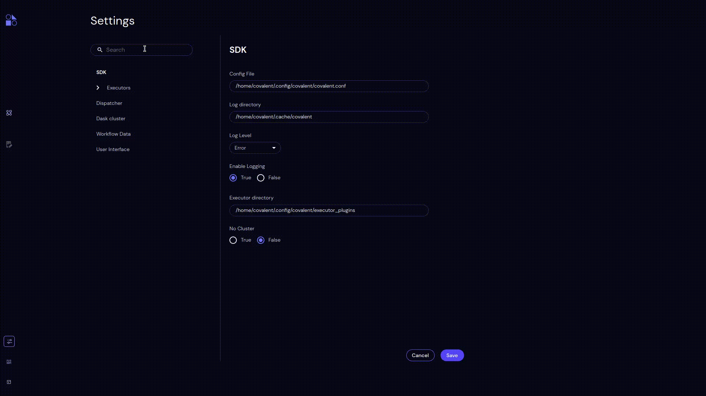

###############
Settings Search
###############

Type one or more characters in the Search text field to filter the listed settings entries. This is useful when you want to find a particular entry in a long list of Executors.

.. note:: On the Settings page, Search matches only uncollapsed Settings. To search the Executors list, you must click the |navigate| icon to uncollapse the list.

Click the |clear| icon in the Search text field to clear the field box.

.. |clear| image:: ../images/clear_search.png
    :width: 20px

.. |navigate| image:: ../images/navigate_next.png
    :width: 20px
