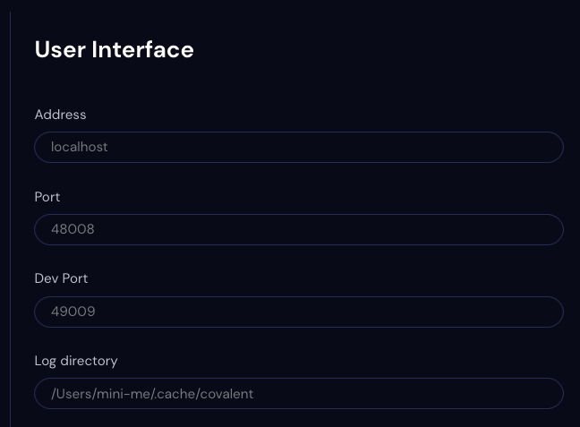

##############
User Interface
##############

Use the User Interface Settings page to view preferences for the Covalent GUI.

.. note:: The User Interface settings are not editable.

Address
    The IP address or name of the UI host, for example localhost.
Port
    The port on which the UI server listens. Default is `48008`.
Dev Port
    A port for contributors to use with debugging code.
Log Directory
    The directory path of the Covalent log. 
