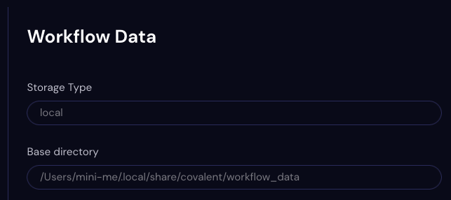

#############
Workflow Data
#############

Use the Workflow Data Settings page to view preferences for the Covalent workflow database.

.. note:: The Workflow Data settings are not editable.

Storage Type
    The database type in which the workflow data are stored. Default is local, using an SQLite database.
Base directory
    The directory path for the workflow database. For a local database, this is the directory containing the :doc:`Dispatcher<dispatcher>` database.
