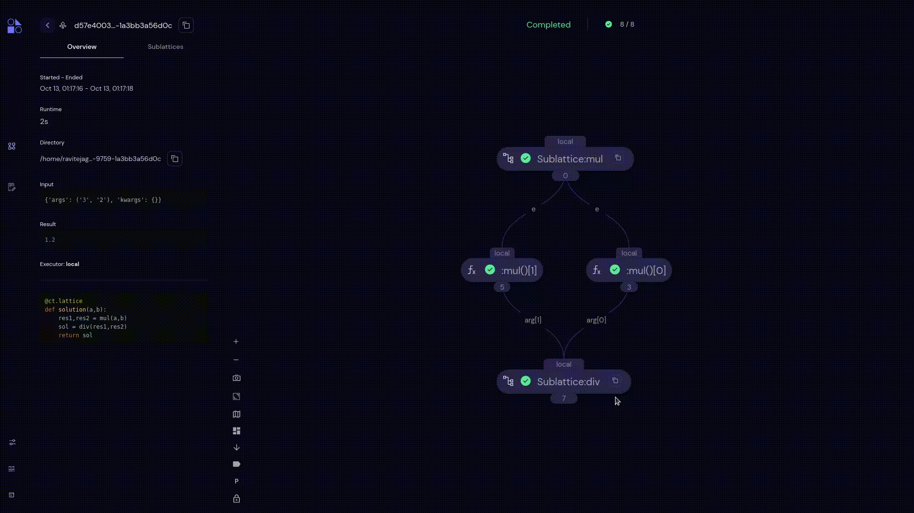

###########################
Sublattices Transport Graph
###########################

A :ref:`sublattice <sublattice>` is a lattice wrapped with an electron decorator so that it behaves as a single task. For example:

.. code:: python

    @ct.electron
    @ct.lattice
    def sub_workflow():
        # Lattice code containing calls to other electrons ...

When you open the Graph View page for a lattice that contains sublattices, the sublattices are displayed as simple (unexpanded) nodes in the transport graph.

Each sublattice in a dispatch has a unique lattice ID (separate from the integer node ID). Click |copy| on the sublattice node to copy the sublattice ID.

Click a sublattice node in the transport graph to view the :doc:`electron sidebar<../graph_view/electron>` of the sublattice. The Electron sidebar for a sublattice displays the dispatch information of the sublattice in its role as an electron: its overall start and end times, its final result, and so on.

To see "inside" the sublattice – to view its component electrons – select the Sublattices tab in the :doc:`Sublattices sidebar<sublattices_sidebar>` to the left of the transport graph. Then click the line item of the sublattice you want to view.

While viewing a sublattice in the Graph View area, the sublattice name is displayed in the upper left as "Viewing: <sublattice name>". Click |revert| to the right of the name to return to viewing the main lattice transport graph.

