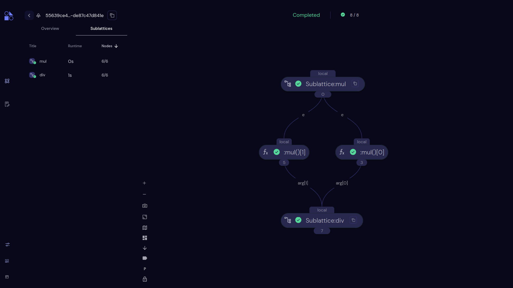

===================
Sublattices Sidebar
===================

- Sublattcies section shows the lattices that are transformed into electrons, which are called sublattices. 
- Sublattices section will only be shown to the dispatches which actually have the sublattices.
- Here, as the user clicks on any sublattice, the transport graph view will only show the constituent nodes/electrons following that particular sublattice.
- These sublattices can be sorted in the following ways: according to the alphabetical order of title; according to the runtime; according to the count of nodes.
 