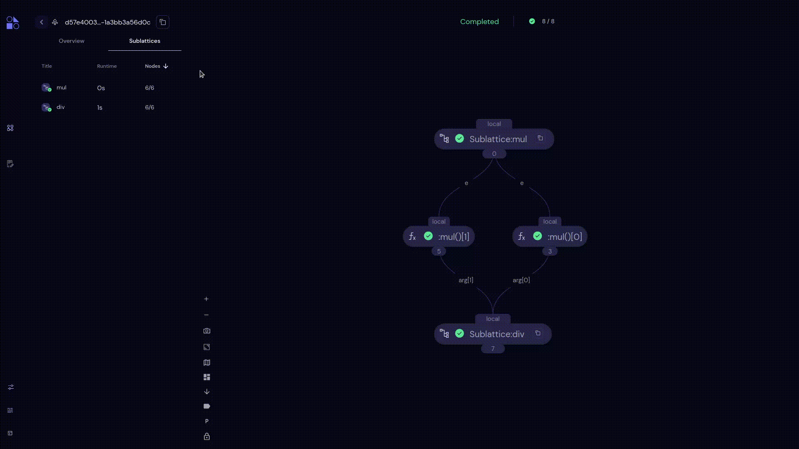

================
Sublattices Sort
================

.. |ascending| image:: ../images/ascending_arrow.png
    :width: 20px

.. |descending| image:: ../images/descending_arrow.png
    :width: 20px

- Users can sort through a column by ascending |ascending| and descending |descending| orderings. By default, sorting is done in descending order of the **Nodes** count .
- Users can sort by the Title, Runtime and Nodes columns.
- Sublattcies can be sorted by alphabetical order of Title; ascending and descending order of Runtime; ascending and descending order of number of nodes.
