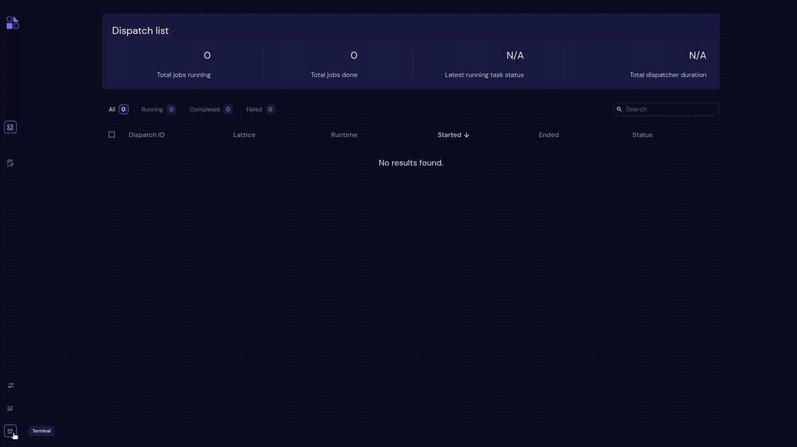

==========
Terminal
==========

Use the Terminal page to execute shell commands. Provided as a convenience for installing dependencies, executing scripted workflows, and so on. This is especially convenient if you host Covalent on a server since it eliminates the need for SSH logins.

.. note:: Stopping the Covalent server in the Terminal kills the terminal and stops the Covalent GUI.
