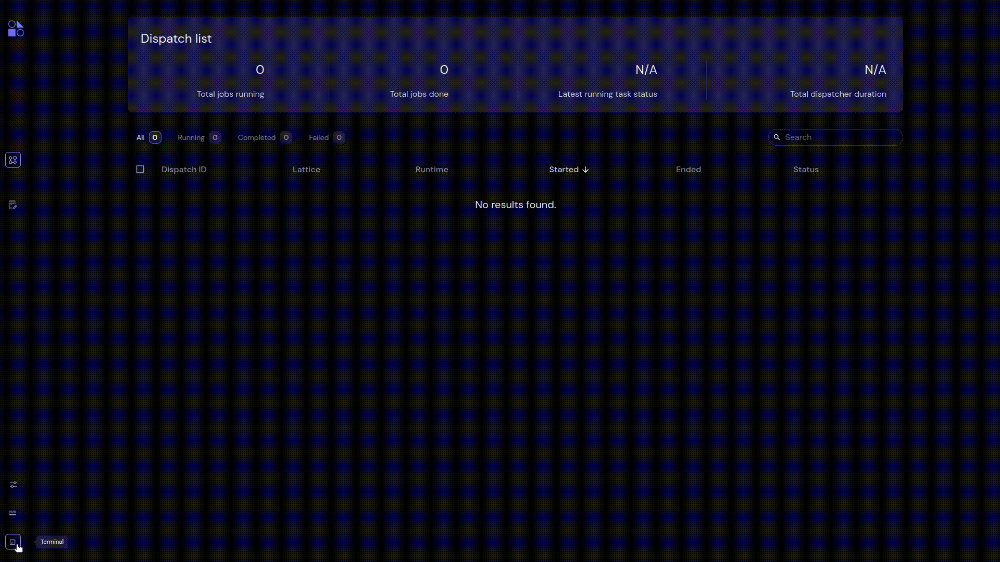

==========
Terminal
==========

- Users can execute the commands in the terminal that's available in **Terminal section**.
- Users can give various commands like installing dependencies to execute workflows and general covalent commands as well.
